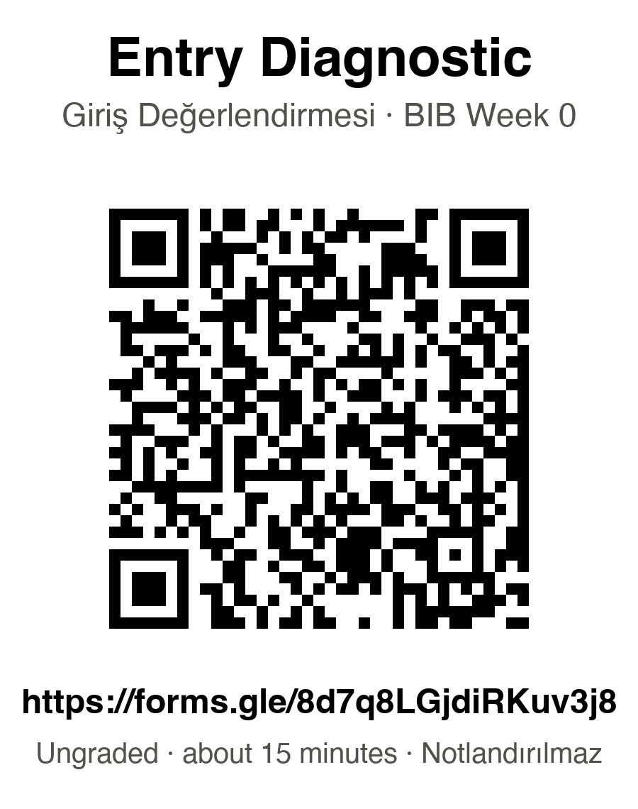

# Bioinformatics for Bioengineering

**Biyomühendislik için Biyoinformatik** · Ege University, Department of Bioengineering
Fourth year, compulsory · 2026–2027

Course materials for students: slides, lab notebooks, the handbook, the workbook and the
reference sheets. Everything here is yours to read, run, print and keep.

---

## First, in class: the Entry Diagnostic

Scan this, or type the address underneath it.

### **https://forms.gle/8d7q8LGjdiRKuv3j8**

**Ungraded — it cannot affect your grade.** About fifteen minutes. No AI, no search, no notes.

Twelve questions that tell me which refresher sections to spend time on. Please choose
**"Not sure"** rather than guessing: a confident wrong answer and an honest "not sure" need
different help from me, and I can only tell them apart if you are straight with me. You will see
the correct answers and a short explanation the moment you submit.

*Notlandırılmaz. Yaklaşık 15 dakika. Emin değilseniz tahmin etmek yerine "Emin değilim" seçin.*

[Entry_Diagnostic.pdf](Entry_Diagnostic.pdf) is the same questions on paper, if you have no phone.

## Then

1. **[Student_Handbook.pdf](Student_Handbook.pdf)** — how the course runs, what is assessed,
   and the AI-use policy. Read this in week 1.
2. **[W00_The_biology_and_numbers_bridge.pdf](W00_The_biology_and_numbers_bridge.pdf)** — the
   refresher. No previous genetics or programming is assumed.
3. **[W01](W01_From_a_biological_question_to_defensible_evidence.pdf)** and its
   [lab notebook](https://colab.research.google.com/github/BMGLab/BFB/blob/main/W01_From_a_biological_question_to_defensible_evidence.ipynb)
   — the first week proper.

## Weekly material

Every week has slides as both PDF and PowerPoint — the PDF reads on a phone and needs nothing
installed. From W01 onward there is also a lab notebook; the badge opens it in Google Colab.

| Week | Topic | Slides | Lab |
|---|---|---|---|
| W00 | The biology and numbers bridge | [pdf](W00_The_biology_and_numbers_bridge.pdf) · [pptx](W00_The_biology_and_numbers_bridge.pptx) | — |
| W01 | From a biological question to defensible evidence | [pdf](W01_From_a_biological_question_to_defensible_evidence.pdf) · [pptx](W01_From_a_biological_question_to_defensible_evidence.pptx) |  |
| W02 | Files, coordinates and reference versions | [pdf](W02_Files__coordinates_and_reference_versions.pdf) · [pptx](W02_Files__coordinates_and_reference_versions.pptx) |  |
| W03 | Reading and checking short Python programs | [pdf](W03_Reading_and_checking_short_Python_programs.pdf) · [pptx](W03_Reading_and_checking_short_Python_programs.pptx) |  |
| W04 | Sequence similarity without overclaiming | [pdf](W04_Sequence_similarity_without_overclaiming.pdf) · [pptx](W04_Sequence_similarity_without_overclaiming.pptx) |  |
| W05 | From sample to reads: designing an experiment | [pdf](W05_From_sample_to_reads__designing_an_experiment.pdf) · [pptx](W05_From_sample_to_reads__designing_an_experiment.pptx) |  |
| W06 | Variation, independence and multiple testing | [pdf](W06_Variation__independence_and_multiple_testing.pdf) · [pptx](W06_Variation__independence_and_multiple_testing.pptx) |  |
| W07 | RNA counts, normalization and defensible expression claims | [pdf](W07_RNA_counts__normalization_and_defensible_expression_claims.pdf) · [pptx](W07_RNA_counts__normalization_and_defensible_expression_claims.pptx) |  |
| W08 | Midterm review and the evidence audit | [pdf](W08_Midterm_review_and_the_evidence_audit.pdf) · [pptx](W08_Midterm_review_and_the_evidence_audit.pptx) |  |
| W09 | Patterns, prediction and data leakage | [pdf](W09_Patterns__prediction_and_data_leakage.pdf) · [pptx](W09_Patterns__prediction_and_data_leakage.pptx) |  |
| W10 | Single cells and biological replication | [pdf](W10_Single_cells_and_biological_replication.pdf) · [pptx](W10_Single_cells_and_biological_replication.pptx) |  |
| W11 | Biological AI and the honest model scorecard | [pdf](W11_Biological_AI_and_the_honest_model_scorecard.pdf) · [pptx](W11_Biological_AI_and_the_honest_model_scorecard.pptx) |  |
| W12 | Protein structures: prediction, confidence and function | [pdf](W12_Protein_structures__prediction__confidence_and_function.pdf) · [pptx](W12_Protein_structures__prediction__confidence_and_function.pptx) |  |
| W13 | From a variant to an evidence-based sentence | [pdf](W13_From_a_variant_to_an_evidence_based_sentence.pdf) · [pptx](W13_From_a_variant_to_an_evidence_based_sentence.pptx) |  |
| W14 | Responsible bioinformatics and your scientific record | [pdf](W14_Responsible_bioinformatics_and_your_scientific_record.pdf) · [pptx](W14_Responsible_bioinformatics_and_your_scientific_record.pptx) |  |

## Running the notebooks

Click a Colab badge above, then immediately do **File → Save a copy in Drive**. Do that *first*:
the badge opens a read-only view of the course copy, and without saving your own copy your work
is lost when the tab closes. You need a Google account; a personal Gmail is fine.

If Colab is unavailable, local Jupyter with Python 3.9 or newer works too — download the
`.ipynb` from the file list above. If you have no laptop at all,
[Paper_Data_and_Demo_Outputs.pdf](Paper_Data_and_Demo_Outputs.pdf) carries the numbers so you
can still work through every question on paper.

Every notebook generates **your own dataset** from your course pseudonym, so your numbers will
not match your classmates'. That is deliberate: a borrowed answer is a wrong answer, and the
point of each exercise is the reasoning you attach to numbers nobody else has.

## Reference material

| File | What it is for |
|---|---|
| [Lab_Workbook.pdf](Lab_Workbook.pdf) | The lab exercises, printable |
| [Lecture_Companion.md](Lecture_Companion.md) | All slide text, searchable — useful for revision and for screen readers |
| [Core_Glossary.pdf](Core_Glossary.pdf) | Terms, English and Turkish |
| [Formula_and_Audit_Sheet.pdf](Formula_and_Audit_Sheet.pdf) | The formulas and the checks you are expected to apply |
| [Practice_Assessment.pdf](Practice_Assessment.pdf) | Practice questions. Not the exam, and not a prediction of it |
| [Project_Briefs_and_Rubrics.pdf](Project_Briefs_and_Rubrics.pdf) | What the projects ask for and how they are marked |
| [Paper_Data_and_Demo_Outputs.pdf](Paper_Data_and_Demo_Outputs.pdf) | Demonstration numbers, so you can work through the questions without a computer |
| [DATA_CATALOGUE.md](DATA_CATALOGUE.md) | Every dataset used, and where it came from |
| [Course_Source_Register.pdf](Course_Source_Register.pdf) | The `[Sxx]` source citations used throughout |

## What is not here

Examination papers, answer keys, marking schemes and the instructor guide are not published.
Do not ask for them, and do not post them if you obtain one.

## Using AI in this course

AI use is **not** banned, and on some assignments it is required. What is assessed is whether
you can tell when a model is wrong. The rules — which assignment sits in which tier, and the
disclosure you must submit — are in the Student Handbook. Read them before your first
submission rather than after.

## A note on the data

Datasets here are synthetic unless a file says otherwise. They are built to behave like real
data for teaching purposes; they are not research results and must not be cited as evidence
about biology.

## Licence and reuse

Prepared by Yasin Kaymaz, PhD, for Ege University, and released under the
[MIT Licence](LICENSE) — you may use, adapt and redistribute this material, including for
teaching elsewhere, provided the copyright notice is kept. No attribution beyond that notice is
required, though it is appreciated.

Two things the licence does not cover. Figures reproduced from published papers remain under
their original terms and are cited where they appear. And the datasets here are synthetic
teaching material: reusing them is fine, citing them as evidence about biology is not.
